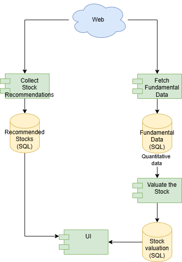

# Architecture Design Document

## High-Level Overview

The Stock Analysis Platform is an AI-powered application that automates the collection and analysis of stock investment recommendations from web sources, combining them with fundamental financial analysis to help users make informed investment decisions.



*Figure 1: High-level system architecture diagram showing components and their relationships*

### System Components

The application consists of four main architectural layers:

1. **User Interface Layer** (`src/ui/`)
   - Streamlit-based web application
   - Multi-page interface for recommendations, favorites, and DCF valuation
   - Password-protected access

2. **Service Layer** (`src/services/`)
   - Business logic for recommendations, valuations, and financial data
   - Integration with external APIs (Yahoo Finance, Finnhub, FMP)
   - Currency conversion and financial calculations

3. **Data Layer** (`src/repositories/`)
   - Database abstractions for stock data (DuckDB) and recommendations (SQLite)
   - Data persistence and retrieval operations
   - S3 storage integration for cloud deployments

4. **Workflow Layer** (`src/recommendations/`)
   - LangGraph-based orchestration for recommendation collection
   - Multi-step workflow: search → scrape → extract → validate → store
   - LLM-powered content extraction and validation

### Data Flow

#### Recommendation Collection Workflow

```
┌─────────────────┐
│ Google Search   │
│ API             │
└────────┬────────┘
         │
         ▼
┌─────────────────┐
│ Search Results  │
│ (URLs, titles)  │
└────────┬────────┘
         │
         ▼
┌─────────────────┐
│ Web Scraping    │
│ (Playwright/    │
│  BeautifulSoup) │
└────────┬────────┘
         │
         ▼
┌─────────────────┐
│ LLM Extraction  │
│ (OpenAI GPT-4o) │
│ Extract stock   │
│ recommendations │
└────────┬────────┘
         │
         ▼
┌─────────────────┐
│ Validation      │
│ (Ticker lookup, │
│  quality score) │
└────────┬────────┘
         │
         ▼
┌─────────────────┐
│ Deduplication   │
│ (Quality-based) │
└────────┬────────┘
         │
         ▼
┌─────────────────┐
│ SQLite Database │
│ (Recommendations)│
└─────────────────┘
```

#### DCF Valuation Flow

```
┌─────────────────┐
│ User Input      │
│ (Ticker, params)│
└────────┬────────┘
         │
         ▼
┌─────────────────┐
│ Financial Data  │
│ (Yahoo Finance) │
└────────┬────────┘
         │
         ▼
┌─────────────────┐
│ DuckDB Storage  │
│ (Financial      │
│  statements)    │
└────────┬────────┘
         │
         ▼
┌─────────────────┐
│ DCF Calculation │
│ (WACC, FCF,     │
│  Terminal value)│
└────────┬────────┘
         │
         ▼
┌─────────────────┐
│ Valuation Result│
│ (Fair price)    │
└─────────────────┘
```

#### Data Storage Architecture

- **DuckDB** (`data/db/stocks.duckdb`): Stores financial statements, stock information, and market data
- **SQLite** (`data/db/recommendations.db`): Stores web-scraped recommendations, webpages, and stock metadata
- **S3** (optional): Cloud backup and synchronization for databases in containerized deployments
- **EFS** (optional): Persistent storage for ECS Fargate deployments

### Why Separate Databases?

The Recommendation service uses a separate SQLite database (`recommendations.db`) instead of storing everything in DuckDB (`stocks.duckdb`). The **primary reason** is operational: to enable the recommendation collection service to run independently as a separate, resource-intensive process. The initial version deploys both services together, but in later version the reccommendation collection can be easily deployed separately.

#### 1. **Independent Service Deployment** (Primary Reason)

The recommendation collection workflow is a **resource-intensive service** that uses heavy web scraping with Playwright (browser automation). This service needs to be able to run separately from the main Streamlit application for several operational benefits:

- **Resource Isolation**: The web scraping workflow consumes significant CPU, memory, and network resources. Running it separately prevents it from impacting the main application's performance
- **Independent Execution**: The workflow can be run as a standalone script (`scripts/run_recommendations_workflow.py`) without requiring the Streamlit application to be running
- **Separate Deployment**: Can be deployed to a different container, machine, or scheduled job (e.g., cron job, AWS ECS task) without needing access to the financial data database
- **Process Isolation**: If the scraping process crashes or consumes too many resources, it doesn't affect the main application or financial data integrity
- **Database Independence**: The recommendation service only needs access to `recommendations.db`, not `stocks.duckdb`, making it a true microservice with minimal dependencies

#### 2. **Different Database Paradigms**

- **DuckDB (Financial Data)**: An analytical database optimized for **OLAP** (Online Analytical Processing)
  - Designed for complex analytical queries, aggregations, and time-series analysis
  - Excellent performance for financial calculations, DCF valuations, and bulk data operations
  - Stores: Financial statements (income, balance sheet, cash flow), historical price data, key ratios, exchange rates

- **SQLite (Recommendations)**: A transactional database optimized for **OLTP** (Online Transaction Processing)
  - Designed for frequent CRUD operations, referential integrity, and ACID transactions
  - Better suited for relational data with foreign keys and complex joins
  - Stores: Web-scraped recommendations, webpage metadata, website tracking, process status, user favorites

#### 3. **Separation of Concerns**

- **Financial data** is sourced from structured APIs (Yahoo Finance, Finnhub) and used for quantitative analysis
- **Recommendations data** is sourced from unstructured web content via LLM extraction and requires different metadata tracking (webpage URLs, quality scores, extraction timestamps)

## Technology Stack

### Core Framework
- **Python 3.13**: Programming language
- **Streamlit 1.30+**: Web application framework for UI
- **uv**: Fast Python package manager and dependency resolver

### AI & Machine Learning
- **OpenAI GPT-4o-mini**: Large Language Model for extracting structured data from unstructured web content
- **LangGraph 0.0.20+**: Workflow orchestration framework for multi-step AI processes
- **LangChain 0.1.0+**: LLM integration and prompt management

### Data Storage
- **DuckDB 1.4.1+**: Analytical database for financial data storage and queries
- **SQLite**: Relational database for recommendations and metadata
- **AWS S3** (via boto3): Cloud storage for database backups
- **AWS EFS**: Elastic File System for persistent storage in ECS deployments

### Data Sources & APIs
- **Yahoo Finance** (yfinance 0.2.66+): Financial statements, stock prices, market data
- **Finnhub API** (finnhub-python 2.4.0+): Real-time market prices and quotes
- **Financial Modeling Prep API**: Stock symbol lookup and company information
- **Google Custom Search API** (google-api-python-client 2.100.0+): Web search for finding recommendation articles

### Web Scraping
- **Playwright 1.40.0+**: Browser automation for JavaScript-heavy websites
- **BeautifulSoup4 4.12.0+**: HTML parsing and content extraction
- **Requests 2.31.0+**: HTTP client for API calls and simple web requests

### Data Processing
- **Pandas 2.0.0+**: Data manipulation and analysis
- **NumPy 1.24.0+**: Numerical computations for financial calculations

### Testing
- **pytest 9.0.0+**: Testing framework with unit and integration test support

### Deployment
- **Docker**: Containerization for consistent deployment
- **AWS ECS Fargate**: Serverless container orchestration
- **AWS Lightsail**: Alternative container service deployment

## Project Structure

```
mpaciu-AE.CAP.1.1/
├── src/                          # Main application source code
│   ├── ui/                       # User interface layer
│   │   ├── main_app.py          # Streamlit main application entry point
│   │   └── pages/               # Multi-page Streamlit app
│   │       ├── 0_Favorites.py   # Favorite stocks page
│   │       ├── 1_Recommendations.py  # Recommendations browsing page
│   │       └── 2_DCF_Valuation.py   # DCF calculator page
│   │
│   ├── services/                 # Business logic layer
│   │   ├── recommendations.py   # Recommendation service (lookup, market data)
│   │   ├── valuation.py         # DCF valuation calculations
│   │   ├── financial.py         # Financial data fetching and storage
│   │   └── currency.py          # Currency conversion utilities
│   │
│   ├── repositories/             # Data access layer
│   │   ├── stocks_db.py         # DuckDB repository for financial data
│   │   ├── recommendations_db.py # SQLite repository for recommendations
│   │   └── create_stocks_db.py  # Database schema initialization
│   │
│   ├── recommendations/          # Workflow and AI components
│   │   ├── workflow.py          # LangGraph workflow orchestration
│   │   ├── prompts.py           # LLM prompts for extraction
│   │   └── fmp_client.py        # Financial Modeling Prep API client
│   │
│   ├── utils/                    # Utility modules
│   │   ├── auth.py              # Password authentication
│   │   ├── logger.py            # Logging configuration
│   │   └── s3_storage.py        # AWS S3 database sync
│   │
│   ├── config.py                # Application configuration
│   └── fin_config.py            # Financial calculation parameters
│
├── data/                         # Data storage
│   ├── db/                      # Database files
│   │   ├── stocks.duckdb        # Financial data database
│   │   └── recommendations.db   # Recommendations database
│   └── input/                   # Input data files
│       ├── market.csv           # Market data
│       └── website.csv          # Website configuration
│
├── docs/                         # Documentation
│   ├── finance/                 # Financial methodology docs
│   │   └── dcf_valuation.md    # DCF calculation details
│   └── ARCHITECTURE.md          # This file
│
├── scripts/                      # Utility scripts
│   ├── run_recommendations_workflow.py  # Manual workflow execution
│   ├── update_stocks_from_yfinance.py   # Stock data update
│   ├── run_tests.py             # Test runner
│   └── load_env_from_ssm.py     # AWS SSM parameter loading
│
├── tests/                        # Test suite
│   ├── test_extract_stock_recommendations.py      # Unit tests
│   ├── test_extract_stock_recommendations_integration.py  # Integration tests
│   ├── test_valuation.py        # Valuation tests
│   └── test_workflow_integration.py  # Workflow integration tests
│
├── deploy/                       # Deployment configurations
│   ├── ecs/                     # AWS ECS Fargate deployment
│   │   ├── task-definition.json
│   │   ├── create-cluster.sh
│   │   └── ECS_FARGATE_DEPLOYMENT.md
│   └── lightsail/               # AWS Lightsail deployment
│       ├── create-container-service.sh
│       └── LIGHTSAIL_DEPLOYMENT.md
│
├── logs/                         # Application logs
│   ├── app/                     # Application logs
│   └── workflow_state/          # Workflow state snapshots
│
├── temp/                         # Temporary files
│
├── pyproject.toml               # Python project configuration and dependencies
├── uv.lock                      # Dependency lock file
├── Dockerfile                   # Docker container definition
├── docker-compose.yml           # Local development Docker setup
├── docker-compose-deploy.yml    # Production Docker setup
├── README.md                    # Project overview and quick start
└── DOCKER.md                    # Docker deployment documentation
```

### Key Directories

- **`src/ui/`**: Streamlit application and user interface components
- **`src/services/`**: Business logic and external API integrations
- **`src/repositories/`**: Database access layer with repository pattern
- **`src/recommendations/`**: AI workflow orchestration and LLM integration
- **`src/utils/`**: Shared utilities (auth, logging, storage)
- **`data/db/`**: Local database files (DuckDB and SQLite)
- **`deploy/`**: Infrastructure as code and deployment scripts
- **`tests/`**: Unit and integration tests

### Design Patterns

- **Repository Pattern**: Data access abstraction in `repositories/`
- **Service Layer Pattern**: Business logic separation in `services/`
- **Workflow Orchestration**: State machine pattern using LangGraph
- **Multi-page Application**: Streamlit pages for feature separation
- **Dependency Injection**: Configuration via environment variables and config files
